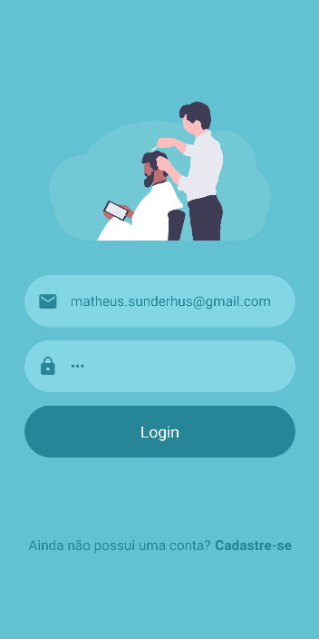
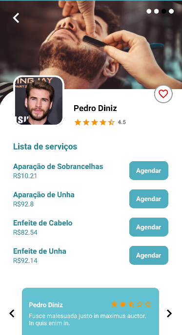

# Lusiaves Challenge App - React Native⚛ + Typescript + Styled components

<hr>

<h1 align="center">
    Lusiaves Challenge<br>
  

</h1>

<p align="center">
  <a href="#-Required">Required</a>&nbsp;&nbsp;&nbsp;|&nbsp;&nbsp;&nbsp;
  <a href="#-Project">Project</a>&nbsp;&nbsp;&nbsp;|&nbsp;&nbsp;&nbsp;
  <a href="#-Layout">Layout</a>&nbsp;&nbsp;&nbsp;|&nbsp;&nbsp;&nbsp;
  <a href="#-Challenge">Challenge</a>&nbsp;&nbsp;&nbsp;|&nbsp;&nbsp;&nbsp;
  <a href="#construction_worker-Execute">Execute</a>&nbsp;&nbsp;&nbsp;|&nbsp;&nbsp;&nbsp;
  <a href="#iphone-Run">Run</a>&nbsp;&nbsp;&nbsp;|&nbsp;&nbsp;&nbsp;
  <a href="#memo-License">License</a>
</p>

<p align="center">

  
  
  
  
</p>

<br>

<p align="center">
  
</p>
<p align="center">
  
</p>

## 🚀 Required

[Node](https://nodejs.org/en/download/)
[Yarn](https://yarnpkg.com/)
[Android Studio](https://developer.android.com/studio)

## 💻 Project

<p>App developed on React Native to complete Lusiaves 🐔 challenge 🪒💈.</p>

## 🔖 Layout
All layout are made by XD file provided.

## 🧠 Improvements
✅  Adding ESLint, Prettier.<br>
✅  Adding styled-components and navigation.<br>
✅  Adding TS.<br>
[ ] Add unit tests to all core components<br>
[ ] add e2e tests to major flows<br>
[ ] Use Github secrets to populate enviroment variables. <br>
[ ] Creating workflow with Github hooks to generated a Android APK artefact.<br>


## :construction_worker: How to execute

```bash
# Clone repository
$ git clone https://github.com/sunderhus/devBarber

```

### :iphone: Run

```bash
# clone and open on your favorite IDE, in my case Visual Studio Code.
$ cd devBarber && code .

# install all dependencies.
$ yarn

#👽 run in Android device emulator .
$ yarn android

#🍎 run in  Ios device emulator .
$ yarn ios
```

## :memo: License

This project is under MIT License. check-out this file here 👉 [LICENSE](LICENSE.md).

---

Made by Matheus Sunderhus : [Linkedin!](https://www.linkedin.com/in/matheus-sunderhus/)
